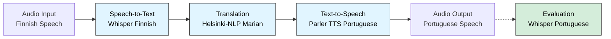

# Finnish to Portuguese Speech Translation

A Rust-based speech translation pipeline using the Candle ML framework that:

1. Records speech in Finnish (single or segmented recording)
2. Transcribes it to text using Whisper
3. Translates from Finnish to Portuguese
4. Synthesizes Portuguese speech output

Supports both single-file recording and segmented recording mode where you can press space to save each sentence separately.

## Architecture

The pipeline processes audio through four stages:



### Pipeline Components

#### 1. Audio Capture (`audio_capture.rs`)

- Records audio from microphone using `cpal`
- Supports automatic resampling to target sample rate
- Converts to mono and normalizes audio
- **No model required** - uses audio processing libraries

#### 2. Speech-to-Text (`speech_to_text.rs`)

- **Model:** [RASMUS/whisper-small-fi](https://huggingface.co/RASMUS/whisper-small-fi)
- Finnish-specific Whisper model for improved Finnish transcription accuracy
- Converts audio to mel spectrogram
- Decodes to text using transformer architecture

#### 3. Translation (`translation.rs`)

- **Stage 1 Model:** [Helsinki-NLP/opus-tatoeba-fi-en](https://huggingface.co/Helsinki-NLP/opus-tatoeba-fi-en)
- **Stage 2 Model:** [Helsinki-NLP/opus-mt-tc-big-en-pt](https://huggingface.co/Helsinki-NLP/opus-mt-tc-big-en-pt)
- Two-stage translation pipeline: Finnish → English → Portuguese
- Uses Marian MT models with separate source/target tokenizers for each stage
- Transformer-based neural machine translation

#### 4. Text-to-Speech (`text_to_speech.rs`)

- **Model:** [freds0/parler-tts-mini-v1.1-ptbr](https://huggingface.co/freds0/parler-tts-mini-v1.1-ptbr)
- Parler TTS model optimized for Brazilian Portuguese
- Neural speech synthesis with natural-sounding voice
- Generates expressive female voice with moderate speed and pitch
- Outputs 24kHz audio with normalization and soft compression

#### 5. Speech Evaluation (`speech_evaluator.rs`) - Test Mode Only

- **Model:** [dominguesm/whisper-tiny-pt](https://huggingface.co/dominguesm/whisper-tiny-pt)
- Portuguese-specific Whisper tiny model for validation
- Transcribes synthesized Portuguese audio back to text
- Provides quality metrics: word accuracy, missing words detection
  (--evaluate flag in --test-mode)

## Requirements

- Rust 1.70+
- **CMake** (required for building sentencepiece dependencies: `brew install cmake`)
- **LLVM/Clang** (required for building on macOS: `brew install llvm`)
- CUDA (optional, for GPU acceleration)
- Metal (optional, for Apple Silicon GPU)
- Working microphone for audio input

## Installation

**Prerequisites (macOS):**

Before building, install required dependencies:

```bash
# Install CMake (required for sentencepiece)
brew install cmake

# Install LLVM (required for Rust bindings)
brew install llvm

# Set LIBCLANG_PATH environment variable
export LIBCLANG_PATH="/opt/homebrew/opt/llvm/lib"
```

**Build the project:**

```bash
export LIBCLANG_PATH="/opt/homebrew/opt/llvm/lib"
cargo build --release
```

Or use the provided build script:

```bash
./build.sh
```

### Download Models (Required First Time)

Before running the application, download the required models:

```bash
export LIBCLANG_PATH="/opt/homebrew/opt/llvm/lib"  # macOS only
cargo run --release -- --download-models
```

This downloads all required models to `./models/` directory:

- Finnish Whisper model (~151 MB)
- Finnish→English translation model (~141 MB)
- English→Portuguese translation model (~1.1 GB)
- Portuguese Parler TTS model (~275 MB)
- Portuguese Whisper model for evaluation (~151 MB)

The download only happens once - existing files are skipped.

**Custom models directory:**

```bash
cargo run --release -- --download-models --models-dir /path/to/models
```

### GPU Acceleration

For CUDA:

```bash
cargo build --release --features cuda
```

For Metal (Apple Silicon):

```bash
cargo build --release --features metal
```

## Usage

### Single recording (5 seconds):

```bash
cargo run --release -- --microphone
```

### Segmented recording (press SPACE to cut each sentence):

```bash
cargo run --release -- --microphone --segmented
```

Creates output files: `output_portuguese_001.wav`, `output_portuguese_002.wav`, etc.

### Custom recording duration:

```bash
cargo run --release -- --microphone --duration 10
```

### Process existing audio file:

```bash
cargo run --release -- --input audio.wav
```

### Test mode (text only, no audio):

```bash
cargo run --release -- --test-mode --test-text "Hei, miten voit?"
```

### Test mode with speech quality evaluation:

```bash
cargo run --release -- --test-mode --test-text "Hei, miten voit?" --evaluate
```

The `--evaluate` flag (only in test mode) will:

1. Synthesize Portuguese speech from the translated text
2. Transcribe it back using a Portuguese Whisper model
3. Compare with expected output and report quality metrics

### Custom output filename:

```bash
cargo run --release -- --microphone --output my_translation.wav
```

### Force CPU mode:

```bash
cargo run --release -- --microphone --cpu
```

### Show original Finnish transcription:

```bash
cargo run --release -- --microphone --show-original
# or use short form:
cargo run --release -- --microphone -s
```

### Use specific device (auto/cpu/cuda/metal):

```bash
# Auto-detect best device (default)
cargo run --release -- --device auto --microphone

# Force CPU
cargo run --release -- --device cpu --microphone

# Use CUDA (if available)
cargo run --release -- --device cuda --microphone

# Use Metal on Apple Silicon (if available)
cargo run --release -- --device metal --microphone
```

### Save input audio when recording:

```bash
cargo run --release -- --microphone --save-input recorded_finnish.wav --output translated_portuguese.wav
```

### Use custom models directory:

```bash
cargo run --release -- --models-dir /path/to/models --microphone
```

### Combined options examples:

```bash
# Segmented recording with original Finnish text shown
cargo run --release -- --microphone --segmented --show-original

# Process file with GPU acceleration and custom output
cargo run --release -- --input finnish_audio.wav --device cuda --output result.wav

# Long recording with custom duration and both input/output saved
cargo run --release -- --microphone --duration 30 --save-input input.wav --output output.wav --show-original
```

## CLI Reference

### All Available Options

```
Options:
  -i, --input <INPUT>              Input audio file (WAV format, 16kHz, mono)
  -o, --output <OUTPUT>            Output audio file path [default: output_portuguese.wav]
      --save-input <SAVE_INPUT>    Save input audio to file (when recording from microphone)
  -m, --microphone                 Record from microphone (default mode if no input file specified)
  -d, --duration <DURATION>        Recording duration in seconds (only used with --microphone) [default: 5]
      --segmented                  Enable segmented recording mode with space key to cut segments
  -s, --show-original              Show the original Finnish transcription text
      --cpu                        Run on CPU rather than GPU
      --device <DEVICE>            Device to use for computation [default: auto] [possible values: auto, cpu, cuda, metal]
      --test-mode                  Use test text instead of audio file (set via --test-text)
      --test-text <TEST_TEXT>      Test text to translate (only used with --test-mode) [default: "Hei, miten voit tänään?"]
      --models-dir <MODELS_DIR>    Directory containing model files [default: ./models]
      --download-models            Download missing models and exit
      --evaluate                   Evaluate synthesized speech quality (test mode only)
  -h, --help                       Print help
  -V, --version                    Print version
```

### Option Compatibility

| Option              | Compatible With                                                                                                 | Notes                                                                       |
| ------------------- | --------------------------------------------------------------------------------------------------------------- | --------------------------------------------------------------------------- |
| `--input`           | `--output`, `--show-original`, `--device`, `--cpu`, `--models-dir`                                              | Cannot use with `--microphone`, `--duration`, `--save-input`, `--segmented` |
| `--microphone`      | `--duration`, `--segmented`, `--save-input`, `--output`, `--show-original`, `--device`, `--cpu`, `--models-dir` | Cannot use with `--input`                                                   |
| `--segmented`       | `--microphone` only                                                                                             | Enables space-key recording mode                                            |
| `--test-mode`       | `--test-text`, `--evaluate`                                                                                     | No audio input/output, text-only translation testing                        |
| `--evaluate`        | `--test-mode` only                                                                                              | Synthesizes and evaluates speech quality                                    |
| `--download-models` | `--models-dir` only                                                                                             | Exits after downloading, ignores all other options                          |
| `--cpu`             | Any audio processing mode                                                                                       | Overrides `--device` setting                                                |
| `--device`          | Any audio processing mode                                                                                       | Ignored if `--cpu` is set                                                   |

## Models Used

All components now use real neural models:

### Active Models

| Component                        | Model                   | HuggingFace Link                                                                              | Size    |
| -------------------------------- | ----------------------- | --------------------------------------------------------------------------------------------- | ------- |
| Speech-to-Text (Finnish)         | Whisper Tiny Finnish    | [Finnish-NLP/whisper-tiny-finnish](https://huggingface.co/Finnish-NLP/whisper-tiny-finnish)   | ~151 MB |
| Translation (Finnish→English)    | Marian MT (Stage 1)     | [Helsinki-NLP/opus-tatoeba-fi-en](https://huggingface.co/Helsinki-NLP/opus-tatoeba-fi-en)     | ~141 MB |
| Translation (English→Portuguese) | Marian MT (Stage 2)     | [Helsinki-NLP/opus-mt-tc-big-en-pt](https://huggingface.co/Helsinki-NLP/opus-mt-tc-big-en-pt) | ~1.1 GB |
| Text-to-Speech (Portuguese)      | Parler TTS Mini PTBR    | [freds0/parler-tts-mini-v1.1-ptbr](https://huggingface.co/freds0/parler-tts-mini-v1.1-ptbr)   | ~275 MB |
| Evaluation (Portuguese)          | Whisper Tiny Portuguese | [dominguesm/whisper-tiny-pt](https://huggingface.co/dominguesm/whisper-tiny-pt)               | ~151 MB |

**Download:** Use `--download-models` flag to download all models (~1.8 GB total). Models are cached locally and only downloaded once.

**Note:** Translation uses a two-stage pipeline (Finnish→English→Portuguese) as direct Finnish-to-Portuguese models are less common. The intermediate English translation is displayed during processing.

## Project Structure

```
src/
├── main.rs              # Main pipeline orchestration
├── audio_capture.rs     # Audio recording functionality
├── speech_to_text.rs    # Whisper-based STT (Finnish)
├── translation.rs       # Marian MT translation (Finnish→Portuguese)
├── text_to_speech.rs    # Parler TTS (Brazilian Portuguese)
└── speech_evaluator.rs  # Portuguese speech evaluation (test mode)
```

## Features

- **Single recording mode**: Record audio for a fixed duration
- **Segmented recording mode**: Press SPACE to cut and save each sentence separately with incremental filenames
- **File input**: Process existing WAV files
- **GPU acceleration**: Supports CUDA and Metal
- **Test mode**: Test translation without audio recording
- **Speech evaluation**: Verify TTS quality by transcribing output (test mode only)

## Current Limitations

1. **Real-time Performance**: Current implementation is batch-based, not optimized for real-time streaming.

2. **macOS Building**: Requires LLVM/Clang to be installed and LIBCLANG_PATH set before compilation.

3. **Voice Variety**: Currently uses a single Brazilian Portuguese female voice. No option to select different voices or dialects.

4. **Model Size**: Total download size is ~1.8 GB (including a large EN-PT translation model). Consider internet bandwidth and disk space for initial download.

5. **Two-Stage Translation**: Uses Finnish→English→Portuguese pipeline instead of direct translation, which may introduce slight quality variations compared to a hypothetical direct model.

## Future Improvements

- [ ] Add streaming audio processing
- [ ] Implement voice activity detection (VAD)
- [ ] Add support for multiple Portuguese voices and dialects (European Portuguese)
- [ ] Optimize for lower latency
- [ ] Add batch processing mode for multiple files
- [ ] Support for other language pairs
- [ ] Improve evaluation metrics with BLEU/WER scores
- [ ] Add voice customization options (speed, pitch, emotion)
- [ ] Implement caching for translation results

## Development

### Testing individual components:

```bash
# Test translation only with evaluation
cargo run --release -- --test-mode --test-text "Hyvää huomenta" --evaluate

# Test with different devices
cargo run --release -- --device cuda --test-mode --test-text "Kiitos"
cargo run --release -- --device metal --test-mode --test-text "Näkemiin"
cargo run --release -- --device cpu --test-mode --test-text "Hei"

# Save both input and output when using microphone
cargo run --release -- --microphone --save-input input.wav --output output.wav
```

## License

MIT

## Acknowledgments

- [Candle](https://github.com/huggingface/candle) - Minimalist ML framework in Rust
- [OpenAI Whisper](https://github.com/openai/whisper) - Speech recognition
- [Finnish-NLP/whisper-tiny-finnish](https://huggingface.co/Finnish-NLP/whisper-tiny-finnish) - Finnish Whisper model
- [dominguesm/whisper-tiny-pt](https://huggingface.co/dominguesm/whisper-tiny-pt) - Portuguese Whisper model
- [Helsinki-NLP](https://huggingface.co/Helsinki-NLP) - OPUS-MT translation models
- [Marian NMT](https://marian-nmt.github.io/) - Neural machine translation framework
- [Parler TTS](https://github.com/huggingface/parler-tts) - Text-to-speech model
- [freds0/parler-tts-mini-v1.1-ptbr](https://huggingface.co/freds0/parler-tts-mini-v1.1-ptbr) - Brazilian Portuguese TTS model
